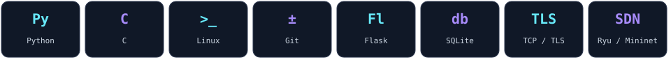
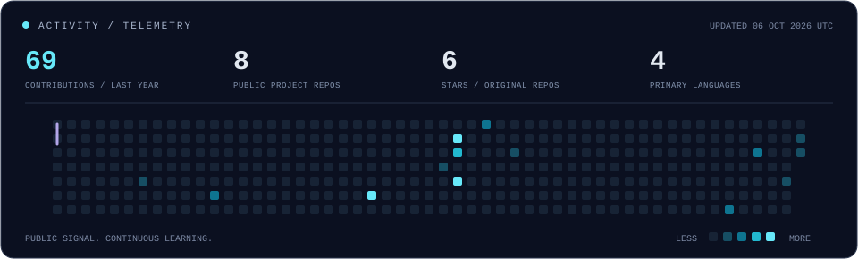

<p align="center">
  
</p>

<p align="center">
  <a href="https://github.com/0-soul-slayer-0?tab=repositories"></a>
  <a href="https://github.com/0-soul-slayer-0/Secure-TCP-Auction-System"></a>
</p>

### `01 / whoami`

I'm **Yekambar Eshwar** — `0-soul-slayer-0`.

Exploring **cybersecurity, networking, and systems programming** by building things and understanding what happens beneath the interface. My public work includes TLS-protected TCP applications, software-defined networking, and C projects.

```text
┌─ soul@github ~
│
├─ focus     → secure communication · network behavior · system internals
├─ approach  → build → inspect → understand → improve
└─ mindset  → stay curious. understand the fundamentals.
```

### `02 / toolkit`

<p align="center">
  
</p>

### `03 / selected builds`

<table>
<tr>
<td width="50%" valign="top">

#### 🔐 Secure TCP Auction System

A real-time auction platform exploring **TLS-encrypted communication**, concurrent bid handling, authentication, and rate limiting.

`Python` `TCP / TLS` `Flask` `SQLite`

**[Inspect the project →](https://github.com/0-soul-slayer-0/Secure-TCP-Auction-System)**

</td>
<td width="50%" valign="top">

#### 🌐 Flow Rule Timeout Manager

An SDN project exploring **OpenFlow rule lifecycles** — from installation and traffic forwarding to idle and hard timeouts.

`Python` `Ryu` `Mininet` `OpenFlow`

**[Inspect the project →](https://github.com/0-soul-slayer-0/Flow-Rule-Timeout-Manager)**

</td>
</tr>
</table>

### `04 / activity stream`

<p align="center">
  
</p>

<details>
<summary><b>Behind this profile</b></summary>
<br />

Custom SVG graphics, a terminal-inspired layout, and a contribution trace generated from GitHub data. The activity panel refreshes daily using GitHub Actions. The graphics include reduced-motion support.

The source lives in **[this repository](https://github.com/0-soul-slayer-0/0-soul-slayer-0)**.

</details>

<br />
<p align="center"><samp>READ THE PACKETS. UNDERSTAND THE SYSTEM. KEEP BUILDING.</samp></p>
